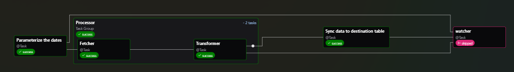

## Airflow Data Pipeline

This repository contains an Airflow-based data pipeline that:

- Ingests data from [API](https://bmrs.elexon.co.uk/actual-or-estimated-wind-and-solar-power-generation).
- Stores data in a Postgres database.

The pipeline is modular, reliable, and designed for extensibility in real-world data engineering workflows.

## Graph


## Prerequisites
- Docker installed.

## Development
1. Clone the repo.
2. Copy the `.env.example` to `.env` and update the values as per your environment.
3. Set `ENV=dev` in `.env`
4. Up the airflow docker containers:
   ```
   docker compose up -d --build
   ```

## Precautions
Remove `config` folders if any error occurs during the setup. To clean up the log remove `logs` folder.

## Dag run
- When you trigger the dag manually, the input date time will UTC time.
- When you trigger the backfill dag, the input date time will be in the local time zone. So, output will be converted to UTC time.
- Logical time is in UTC time.

## Testing
It is recommended to perform unit test before commiting the code. To run unit test, ensure `ENV=dev` in `.env`.

To access the server:
```
docker compose exec -it airflow-apiserver bash
```
and run the following command:

```
pytest
```

The test contains the following:
1. Integrity test on the Dag.
2. Unit test on the Dag tasks.
3. Unit test on every relevant function.

DAG Loader Test:
```
python dags/dag_psr_sync.py
```
```
time python dags/dag_psr_sync.py
```
Dag Run test:
```
airflow dags test psr_sync
```
params: `--conf '{"date_from":"2025-01-01T00:00:00Z","date_to":"2025-01-01T00:30:00Z"}'`

Task test:
```
airflow tasks test psr_sync parameterize
```
params: `--task-params '{"date_from":"2025-01-01T00:00:00Z","date_to":"2025-01-01T00:30:00Z"}'`

**Note:** Available tasks: `airflow tasks list psr_sync`. **Task test does not fit with existing dags**.

## Type Checking and Linting
This repo uses `pre-commit` hooks to check type and linting before committing the code.

Virtual environment:
```
python -m venv .venv
```
Activate:
```
source .venv/bin/activate
```
In Windows, use:
```
.venv\Scripts\activate
```
Install:
```
pip install pre-commit
```
Enable:
```
pre-commit install
```

## Production
1. Clone the repo.
2. Copy the `.env.example` to `.env` and update the values as per your environment.
3. Set `ENV=prod` in `.env`
4. Up the airflow docker containers:
   ```
   docker compose -f compose.yml up -d --build
   ```

## Docker Image
The production-ready Docker image is automatically built and published to [Docker Hub](https://hub.docker.com/r/likh/airflow-data-pipeline) on every new GitHub Release.

Pulling the Image:
```
docker pull likh/airflow-data-pipeline:latest
```
**Recommended to pull a specific tag (e.g. v1.0.0).**

## License
This project is licensed under the MIT License - see the [LICENSE](LICENSE) file for details.
